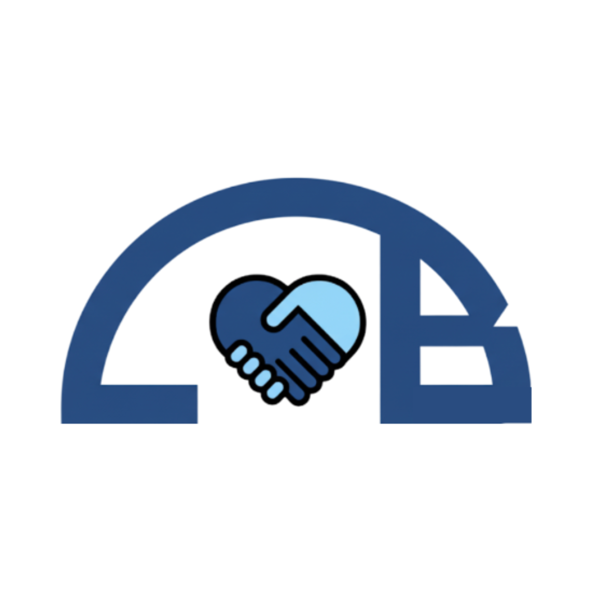

# Civic Bridge
  

Key files are provided; email vin.bhat@outlook.com for full package and installation instructions if you are interested.

Civic Bridge is an innovative AI agent that helps users learn about public services like Medi-Cal & CalFresh, determine eligibility, navigate complex forms and enroll in services.  
  
Civic Bridge is fully accessible to users who are vision-impaired, aren’t familiar with English or are confused by the process of accessing vital public services. In fact, nearly a quarter of all users aged 18-64 aren’t insured because they find the enrollment process for Medi-Cal too difficult or confusing.  
  
Users can talk or type to the Civic Bridge AI agent to get guidance on which services are a fit for their needs and check their eligibility for services like Medi-Cal after providing a few simple details. Users can even switch between audio and text or languages mid-conversation because Civic Bridge is natively multi-modal and multi-lingual. 
  
The Civic Bridge agent can intelligently fill out Medi-Cal forms based on information provided by users in simple conversations, automatically completing multiple fields and selecting options on the Medi-Cal website. This is powered by sophisticated AI that can interpret the user's specific situation to answer questions on the medi-cal form e.g. as shown in the live demo, the Civic Bridge AI understands tax rules for alimony payments (i.e. alimony payments are not tax deductible in most cases post the year 2018). The Civic Bridge agent then selects the right option on form without any action necessary from the user. The results are then previewed with the user before they submit the form.  
  
Civic Bridge is also open source and easily extensible by the community to support public services beyond Medi-Cal.  
  
Civic Bridge makes what can be a confusing, complex and stressful process, especially for the most underserved users, simple and easy, akin to a “TurboTax for public services,” if Turbo Tax was free and open!  
